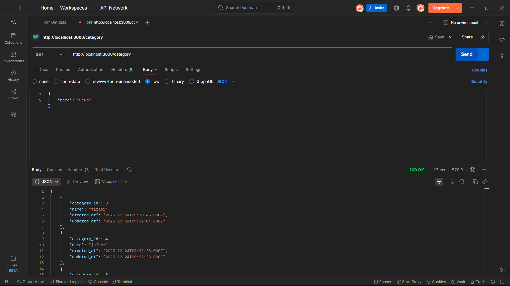
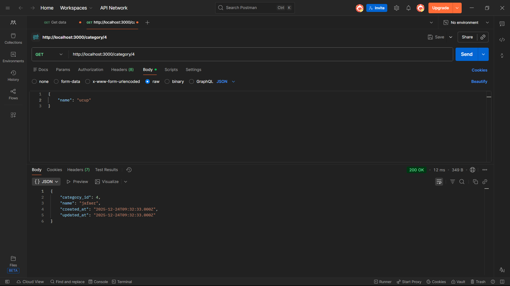
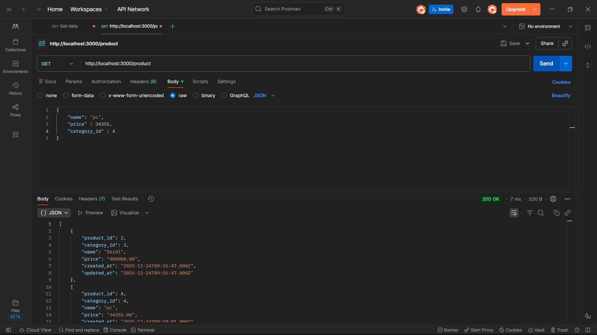
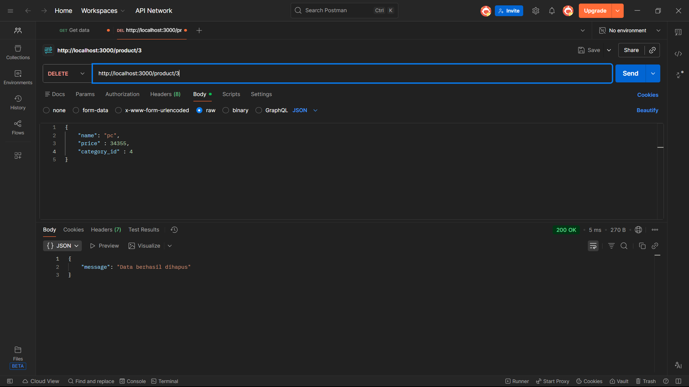

<h1>TUTORIAL MENJALANKAN</h1>

YANG PALING UTAMA BUKA LAPTOP

JANGAN LUPA NYALAKAN LAPTOP

DAN GAK KALAH PENTING, PASTIKAN ADA INTERNET

1. Buka XAMPP
   
2. Start Mysql

3. Start Apache

4. Download atau clone project ini di VSCode

5. untuk menjalankan project ini, ketika "npm tun dev" di terminal Command Prompt

<h2>CATEGORY</h2>
1. Menampilkan semua data

2. menampilkan data berdasarkan ID

3. mengupdate data

4. menambahkan data

5. menghapus data

<h2>PRODUCTS</h2>
1. Menampilkan semua data

2. menampilkan data berdasarkan ID

3. mengupdate data

4. menambahkan data

5. menghapus data

